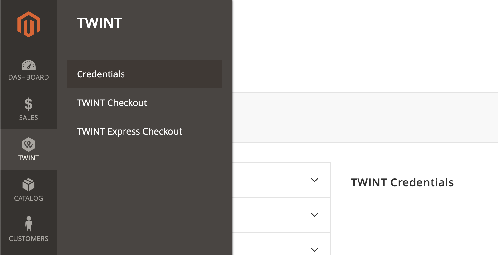
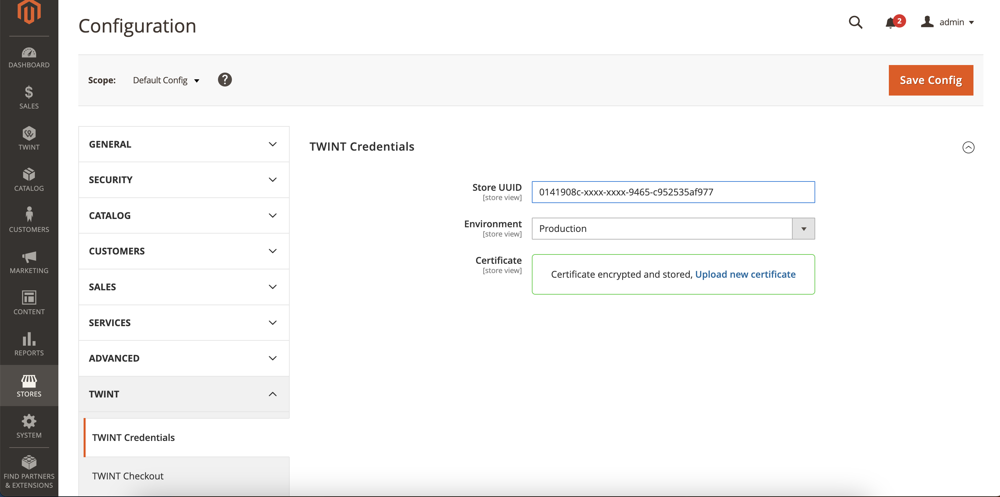
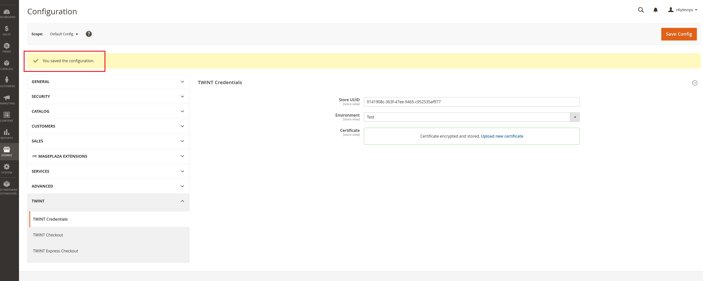
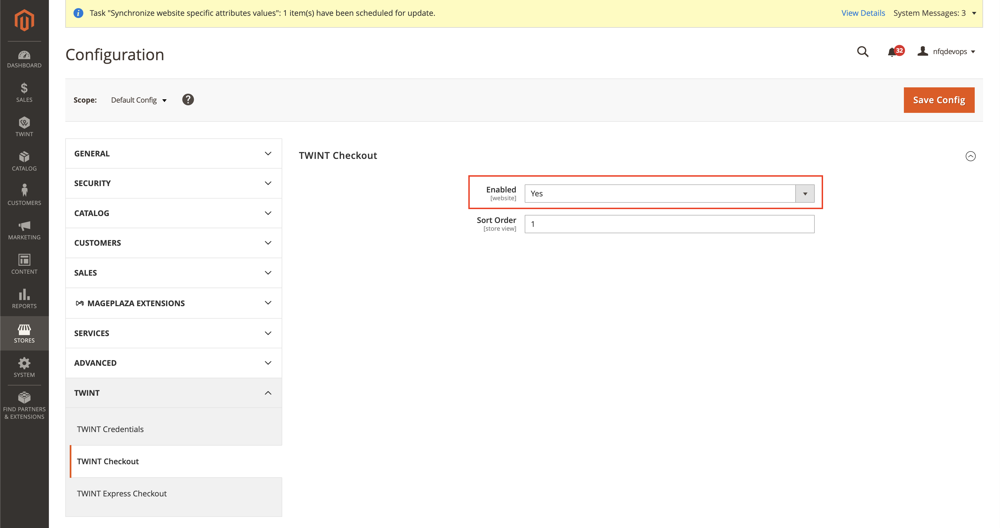
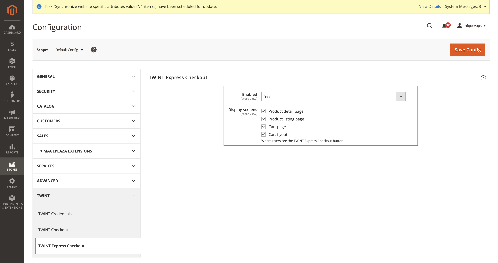
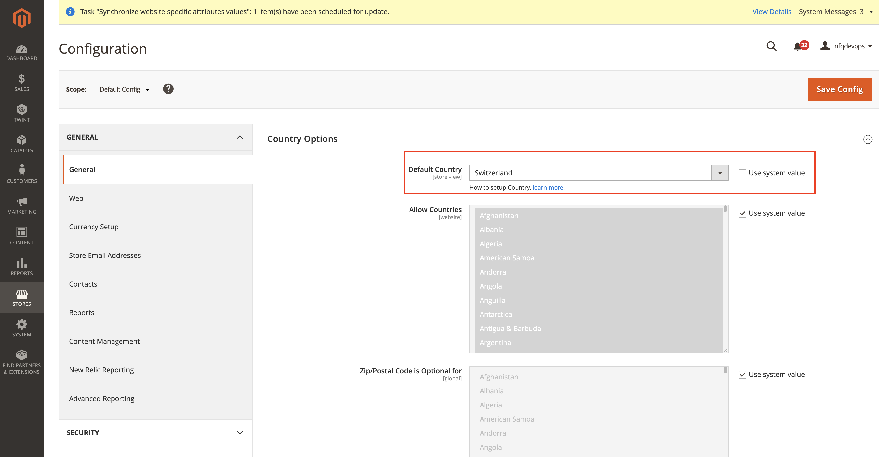
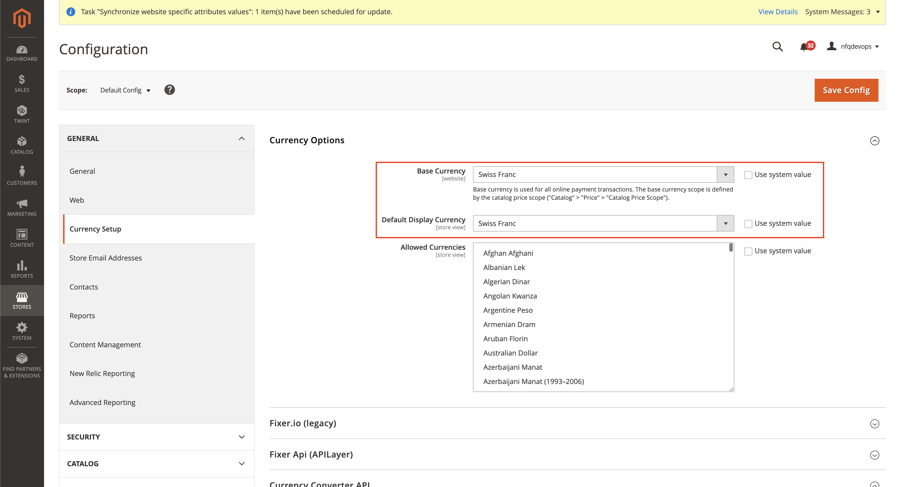

<b>TWINT Payment Module Guideline</b>

## Install the module

Please refer to the `README.md` for the installation steps.

## Configure the module

### Enter the Credentials

#### 1. Login to the Admin console panel

#### 2. Go to `TWINT -> Credentials` or `STORE -> Configuration -> TWINT -> TWINT Credentials`

- Enter the `Store UUID`.
- Under the `Certificate file` click `Choose file` and browse to the `*.p12` certificate file.
- Enter the `Certificate password`.
- **For test environment:** please select the `Test` option under the `Environment` dropdown.

> 🚩 **Note:** 
>
> After entering the certification password, please wait for the message `Certificate encrypted and stored` to shows up in the `Certificate` field before clicking `Save Config`

### Configure the payment methods

#### 1. Go to `TWINT -> TWINT Checkout`

- Ensure that `TWINT Checkout` payment method is enabled (`Yes` option is selected for `Enabled` dropdown).

#### 2. Go to `TWINT -> TWINT Express Checkout`

- Ensure that `TWINT Express Checkout` payment method is enabled (`Yes` option is selected for `Enabled` dropdown).
- Under the `Display screens` section -> Choose the placement for displaying the `TWINT Express Checkout` button.

> ⚠️ Disclaimer
> 
> Merchandise with variable shipping cost (e.g. Table Rate shipping) may not be eligible for `TWINT Express Checkout`.

## Country and Currency

### Country

Under `Stores -> Configuration -> General`, ensure that:

- `Use system value` checkbox is unchecked.
- And `Switzerland` is selected for `Default Country`.

### Currency

Under `Stores -> Configuration -> General -> Currency Setup`, ensure that:

- `Use system value` checkbox is unchecked.
- `Swiss Franc` is selected for Base (and Default) currency.

