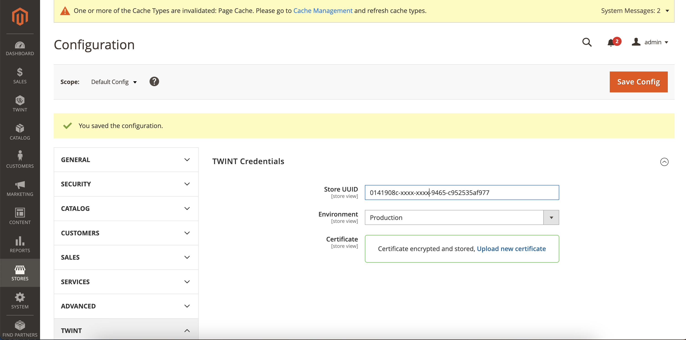

<b>TWINT Payment Extension Guideline</b>

## Install the extension

Please refer to the `README.md` for the installation guide.

## Configure the extension

### Enter the Credential

#### 1. Login to the Admin console panel

#### 2. Go to `TWINT -> Credentials` or `STORE -> Configuration -> TWINT -> TWINT Credentials`

- Enter the `Store UUID`.
- Under the `Certificate file` click `Choose file` and browse to the `*.p12` certificate file.
- Enter the `Certificate password`.
- **For test environment:** please select the `Test` option under the `Environment` dropdown.

>🚩 **Note:** 
>
> After entering the certification password, please wait for the message `Certificate encrypted and stored` to shows up in the `Certificate` field before clicking `Save Config`

### Configure the payment methods

#### 1. Go to `TWINT -> TWINT Checkout`

- Ensure that `TWINT Checkout` payment method is enabled (`Yes` option is selected for `Enabled`downdown).

#### 2. Go to `TWINT -> TWINT Express Checkout`

- Ensure that `TWINT Express Checkout` payment method is enabled (`Yes` option is selected for `Enabled`downdown).
- Under the `Display screens` section -> Choose the placement for displaying the `TWINT Express Checkout` button.

## Languages and Currency

### Configure multi-lingual store

- To support multi-languages, the coressponding language packs should be installed first (in the backend system).
- Under `Stores -> All Stores` A dedicated store view must be created for each desired language (please see the screenshot below for your example).

- Go to `Stores -> Configuration` -> select the corresponding store view under `Scope` (please confirm the scope switching popup).
  - For each store view, under `General -> Locale` -> Uncheck the `Use system value` checkbox and select the corresponding country.

### Currency

Under `Stores -> Configuration -> General -> Currency Setup`, ensure that:

- `Use system value` checkbox is unchecked.
- `Swiss Franc` is selected for at least base (and default) currency.

